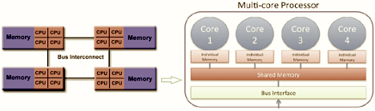

ARCH Terminology
################

This is a high-level overview of core terms and architecture relevant to users of the Rockfish Cluster at ARCH.

.. contents::
   :local:
   :depth: 1

Hardware Terminology
********************

**Node:**  
A single physical server (a “computer in a box”) within a cluster. Each node typically contains CPUs, memory (RAM), and networking components.

**Cluster:**  
A group of nodes connected by a high-speed network that work together to run jobs in parallel or concurrently.

**CPU (Central Processing Unit):**  
The traditional processing unit of a computer. Modern CPUs have multiple cores, each of which can process independent tasks.

**Socket:**  
A physical slot on a motherboard where a CPU is installed. A node may have multiple sockets, each with its own cores and memory access paths.

**Core:**  
An individual execution unit within a CPU. Multiple cores can run different tasks at the same time.

**NUMA (Non-Uniform Memory Access):**  
A memory architecture where memory is distributed across multiple CPUs (sockets), and each CPU can access its own local memory faster than memory on other CPUs.

**GPU (Graphics Processing Unit):**  
A specialized processor with many small cores designed for massive parallelism. Commonly used in AI, ML, simulations, and image processing.

**Memory (RAM):**  
Temporary storage used by programs while they are running. Jobs request and consume memory on the compute nodes.

**Interconnect:**  
The high-speed internal network (e.g., InfiniBand) used for communication between nodes in a cluster.

Software and Scheduling
***********************

**HPC (High Performance Computing):**  
The use of powerful computing systems to solve complex problems requiring significant processing power and parallelism.

**Slurm:**  
An open-source, fault-tolerant, and scalable job scheduler used to allocate resources and schedule jobs on Rockfish.  
See the `Slurm overview <https://slurm.schedmd.com/overview.html>`__.

**Job:**  
A job is a user-submitted request to run a script or set of commands on the cluster. Jobs may include one or more tasks and are managed by Slurm.

**Task:**  
A single unit of computation, typically run on one core. A job may consist of one or many tasks.

**Process:**  
A running instance of a program. A process may include one or more threads and executes independently on a core.

**Thread:**  
A lightweight execution unit within a process. Threads can run concurrently and share memory.

**Job Script:**  
A shell script submitted to Slurm, containing job directives (prefixed with `#SBATCH`) that define resource needs, walltime, and the job’s commands.

**Walltime:**  
The maximum amount of time a job is allowed to run. If a job exceeds its walltime, it will be automatically terminated by the scheduler.

**Partition:**  
A grouping of nodes with shared characteristics (e.g., GPU-enabled, high-memory). Jobs must be submitted to a specific partition to access those resources.

**Interactive Session:**  
A real-time login session on a compute node, often used for debugging, exploratory work, or running graphical tools.  
Requested using `srun` or Rockfish’s `interact` command.

**Module System (Lmod):**  
Environment modules used to load and manage software packages on Rockfish. Users load software with:

.. code-block:: console

   module avail
   module load <package_name>

Data and Storage
****************

**File System:**  
The organizational structure for storing and accessing data on Rockfish. Common file systems include `/home`, `/data`, `/scratch4`, and `/scratch16`.

**Scratch Space:**  
Temporary high-performance storage intended for intermediate data. Files not accessed for 30 days are automatically purged. Not backed up.

**Data Space:**  
Longer-term shared group storage for high-value research outputs. Files stored in `/data` are not automatically deleted but also not backed up.

**Quota:**  
A limit on the amount of storage or number of files a user or group can consume on a given filesystem. View usage with the `quotas.py` tool.

**Throughput vs. Latency:**  
- **Throughput** refers to how much data can be moved over time (e.g., MB/s)  
- **Latency** is the time it takes to start a transfer  

**Checkpointing:**  
The practice of periodically saving a job’s state so it can be resumed after a failure or timeout. Useful for long-running simulations.