File Transfers
################################

Copy Files with SCP
===================

Use the ``scp`` command to copy files or directories to Rockfish:

.. code-block:: console

  scp -r <DIR> <userid>@rfdtn1.rockfish.jhu.edu:/scratch16/<PI-id>/<userid>/

Synchronize with Rsync
======================

Use ``rsync`` for efficient file syncing:

.. code-block:: console

  rsync -rav ~/data <userid>@rfdtn1.rockfish.jhu.edu:~/data/
  rsync -rav --delete --exclude-from=~/exclude.txt ~/data <userid>@rfdtn1.rockfish.jhu.edu:~/data/

.. note::
   - ``--delete`` removes files not present in the source
   - ``--exclude-from`` uses a file to skip listed files

Data Transfer with Globus
=========================

The recommended method for transferring large data files to and from the Rockfish cluster is to use `Globus <https://www.globus.org>`_. Globus manages transfers reliably in the background, handling restarts if interruptions occur.

1. Connect to Globus
**************************

Use your browser to visit: https://www.globus.org

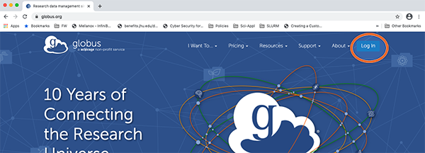

2. Search for Johns Hopkins
***************************

Search and select **“Johns Hopkins”** as your institution.

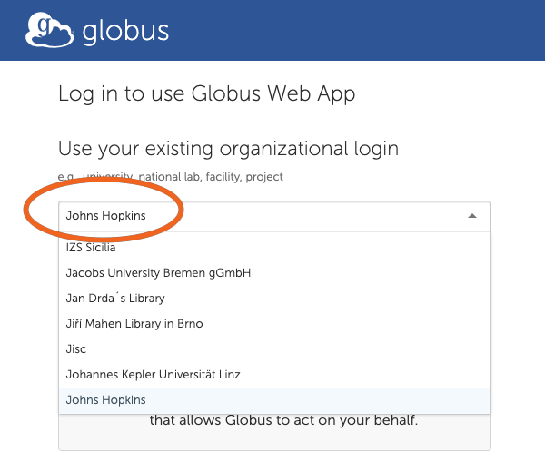

3. Log in with JHED ID
**************************

Use your JHED ID to log in through the Johns Hopkins SSO portal.

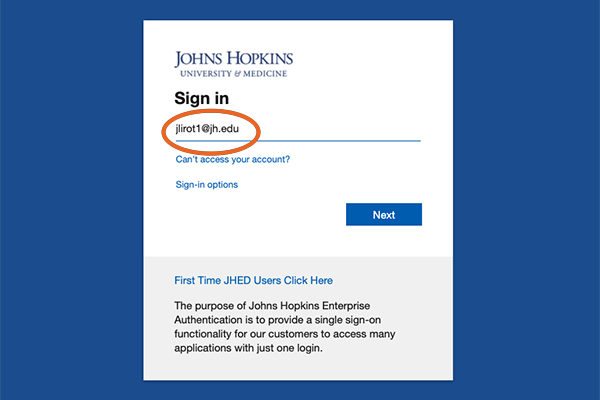

4. Search for the Rockfish Collection
**************************************

After logging in, search for the collection **“rockfish”** in the Collection Search screen. Click on **“Rockfish User Data”** when it appears.

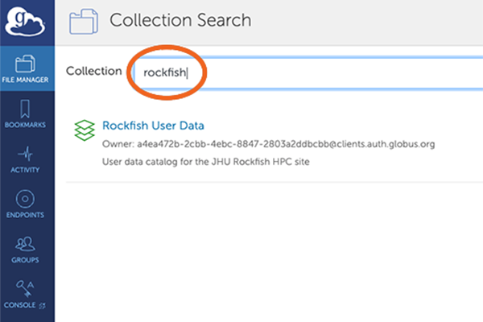

5. Authenticate Access
**************************

You'll be prompted to authenticate with the “Rockfish User Data” collection. This is required on first access or after removing the collection.

Click **“Continue”**.

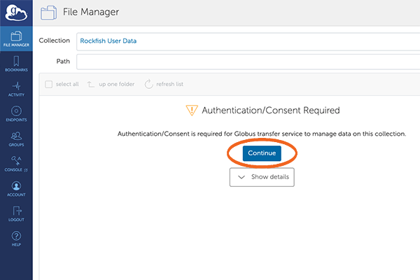

6. Select Your JHED Identity
******************************

Choose your JHED ID from the list of available identities.

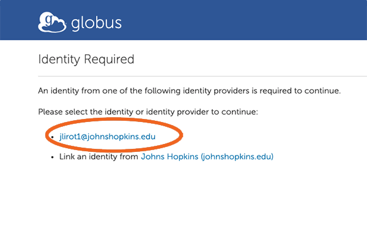

7. Allow Access to the Globus Web App
**************************************

Scroll to the bottom and click **“Allow”** to authorize access.

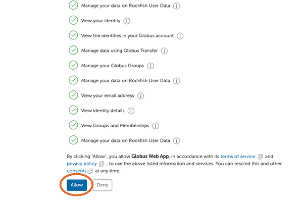

8. Rockfish Endpoint
**************************

Once authorized, you will see the Rockfish endpoint connected (your HOME directory).

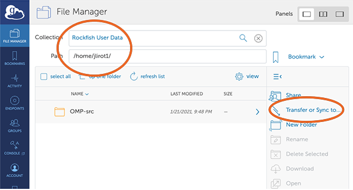

9. Choose a Second Endpoint
***************************

On the other side of the interface, select a second endpoint. This could be:
- A Globus Connect Personal instance (e.g., your laptop)
- An HPC system like Bridges2

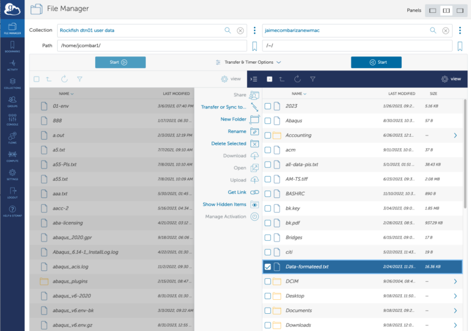

10. Authentication for Second Endpoint (if needed)
**************************************************

You may be asked to authenticate to the second system. If using your own Globus Connect Personal setup, you might not need additional authentication.

11. File Manager View
**************************

You’ll now see a **split-pane interface**. The left side shows your Rockfish files. The right side shows your selected endpoint.

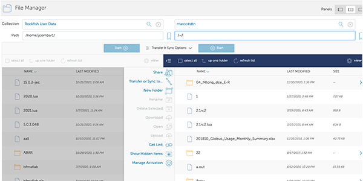

12. Start File Transfer
**************************

To transfer files:
- Select the folder or files (e.g., "OMP-src") on one side.
- Click **“Start”** to begin the transfer.

You can also open **“Transfer & Sync Options”** to configure behavior like sync mode or overwrite rules.

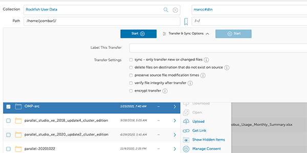