Open OnDemand
##############

Open OnDemand (`OOD`_) is an NSF-funded open-source HPC portal. It is a way for all our users to access the Rockfish cluster HPC resources via a web interface. It is a web-portal that provides a shell, file browser, and graphical interface for applications such as IGV, Matlab, ParaView, Jupyter and RStudio Server, etc.

.. _OOD: https://portal.rockfish.jhu.edu

Access Requirements
***********************
- A valid **Rockfish account**
- A connection to the **campus network or VPN**

When you first navigate to `OOD`_ you will be presented with a login screen. You can use your JHED ID and password to log in.

|ood1|

After logging in, you'll land on the main dashboard. The dashboard provides a listing of "Pinned Apps" that users can choose from.

|ood2|

The top navigation bar includes:

- **Apps** – A listing of pinned applications.
- **Files** – Upload, download, and manage files in your home directory.  
- **Jobs** – View active jobs and the job composer tool.
- **Clusters** – Shell access to Rockfish login nodes.
- **Interactive Apps** – Launch graphical sessions
- **My Interactive Sessions** – A listing of current sessions

|ood4|

Interactive Apps (Plugins)
**************************

Interactive Apps allow users to start graphical or web-based sessions that run on compute nodes. These include:

- Remote Desktop (Linux GUI)  
- JupyterLab / Jupyter Notebook  
- RStudio Server  
- MATLAB  
- IGV  
- Abaqus/CAE  

These apps run within batch jobs submitted to the cluster using Slurm.

|ood5|

Remote Desktop
****************

When a graphical interface is needed, OOD's Remote Desktop replaces complex tools like X11 forwarding or VNC setup.

First request the desktop application, i.e. anything under Interactive Apps, which you would like to use. Here we choose the Desktop.

|ood6|

You will next see a form to specify the resources you’d like for the job. Specifically the duration of the job (wall time), the number of cpus (cores), node type, etc. Below we ask for five hours and 2 cores. We also optionally specify a standard compute defq  with 4 Gb memory each cpu. If you wish you can also receive an email notification for when the job starts. Once you have filled out the form click Launch.

|ood7|

Once you launch the job, you will be presented with a notification that your job has been queued. Depending on the resources requested, your job should be scheduled within minutes. Then you will see the option to launch your session. Choose your display settings and click the launch button for your particular application, in this case Launch Remote Desktop.

|ood8|
|ood9|

Once Slurm Scheduler is ready to use the requested resource, click Launch.

|ood10|

|ood11|

.. tip::
  If the app doesn’t launch, check the Session ID and view the `output.log` for debugging.

Jupyter Lab / Notebook
**********************

This app will launch a `Jupyter`_ on one or more nodes, creating an interactive session that users will be able to launch a Jupyter Server within a batch job in a compute node. They will then be able to connect to the running server through their browser and take advantage of the resources provided within the batch job.
GPU specification is optional for the partitions that have them.

.. _Jupyter: https://jupyter.org/

|ood12|

 :guilabel:`Defq` Standard Compute these are standard HPC machines. Rockfish has nodes with 48 cores and 192 GB of memory. All compute nodes have 192 GB of RAM. Chosing "defq" as the node type will decrease your wait time.

 :guilabel:`Bigmem` Large Memory these are HPC machines with very large amounts of memory. Rockfish has also bigmem nodes with 48 cores and 1.5 TB of RAM.

 :guilabel:`GPU` these are HPC machines with GPUs. Rockfish has nodes with 4 NVIDIA Tesla `A100`_ GPU and NVIDIA Tesla `V100`_ GPUs.

They have the same CPU and memory characteristics of standard compute.

.. _A100: https://www.nvidia.com/en-us/data-center/a100/
.. _V100: https://www.nvidia.com/en-us/data-center/v100/

|ood13|

Add multiple environments
^^^^^^^^^^^^^^^^^^^^^^^^^

You can use ipkernel and add multiple envs and select it inside Jupyter, just following the next instructions.

|ood14|

In a terminal console on Rockfish cluster run these commands:

.. code-block:: console

  Change to the proper version of python or conda
  ^^^^^^^^^^^^^^^^^^^^^^^^^^^^^^^^^^^^^^^^^^^^^^^^

  ## For Python Virtual environment

        $ module load python; source <myenv>/bin/activate

  ## For Conda environment

        $ module load anaconda; conda activate <myenv>

  then:

        (myenv)$ pip install ipykernel

  Install Jupyter kernel
  ^^^^^^^^^^^^^^^^^^^^^^
        (myenv)$ ipython kernel install --user --name=<any_name_for_kernel> --display-name "Python (myenv)"

  Listing all the available environments (kernels)
  ^^^^^^^^^^^^^^^^^^^^^^^^^^^^^^^^^^^^^^^^^^^^^^^^
        (myenv)$ jupyter kernelspec list

Troubleshooting
***************

Bad Request
^^^^^^^^^^^

 * Message : Your browser sent a request that this server could not understand. Size of a request header field exceeds server limit.

 **Solution** : Clear cache and cookies in your web browser.

 * Message : Requested resource does not exist.

 **Solution** : Enter URL https://portal.rockfish.jhu.edu/

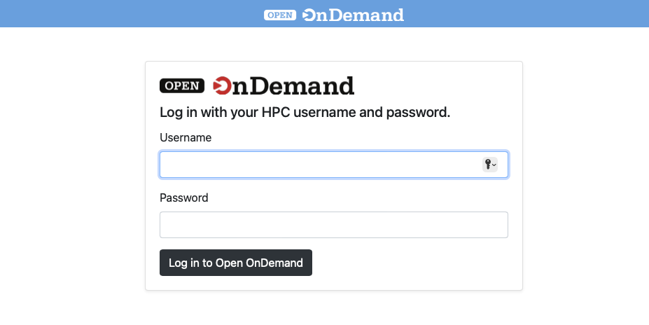

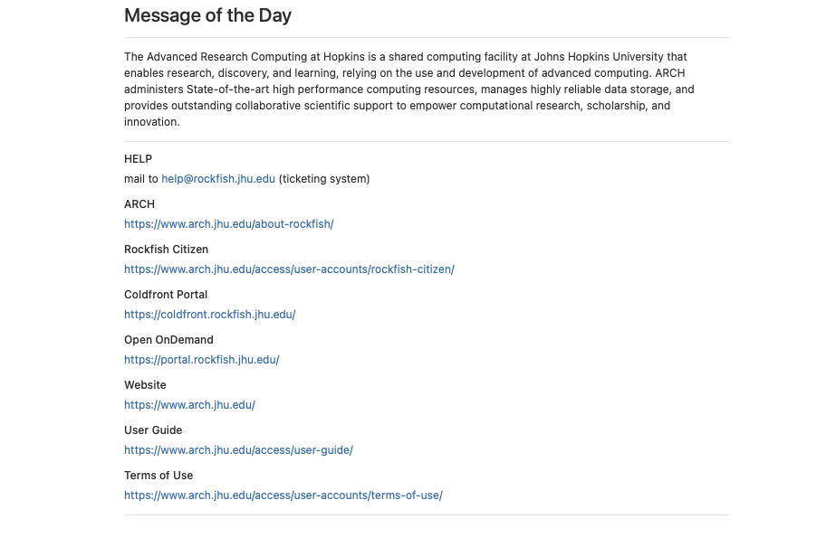

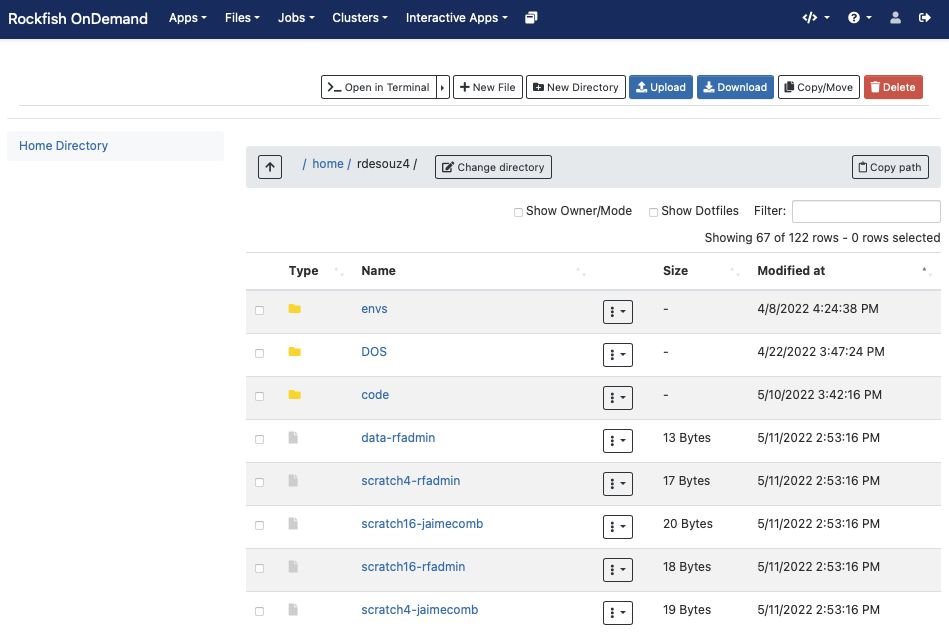

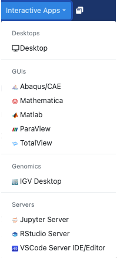

.. |ood6| image:: ../images/ood6.png
  :alt: Remote
  :width: 100 %

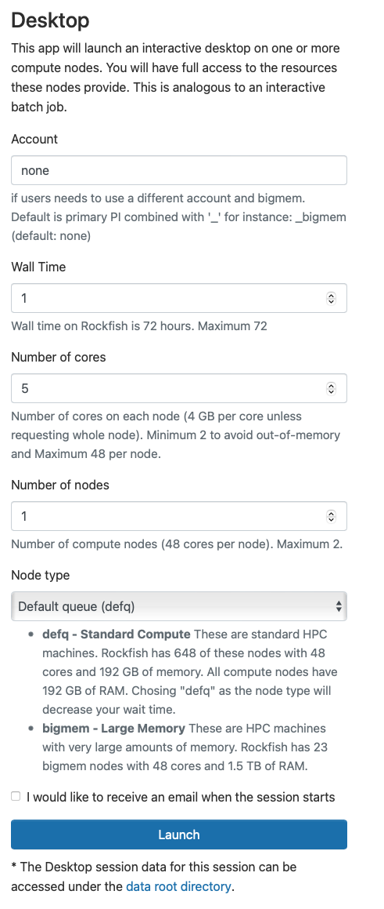

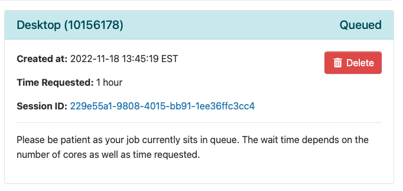

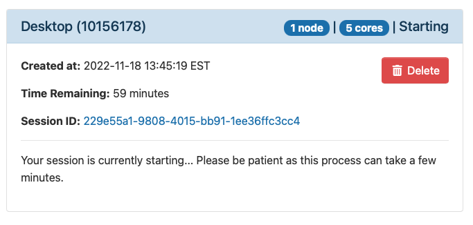

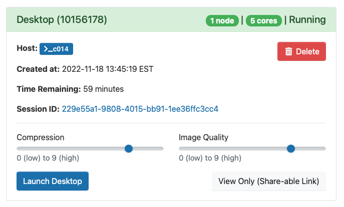

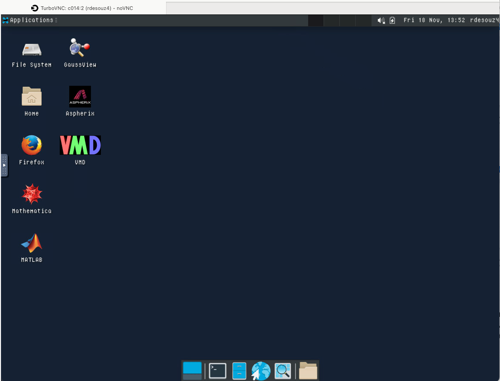

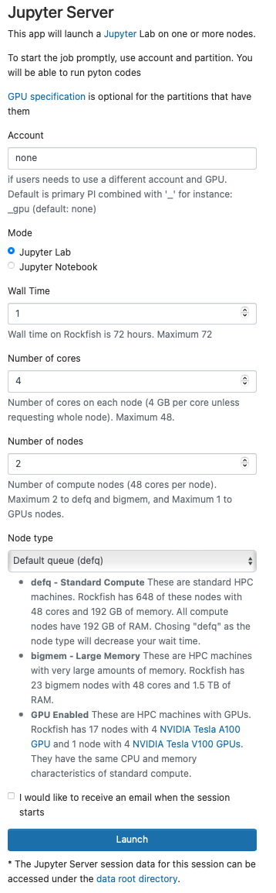

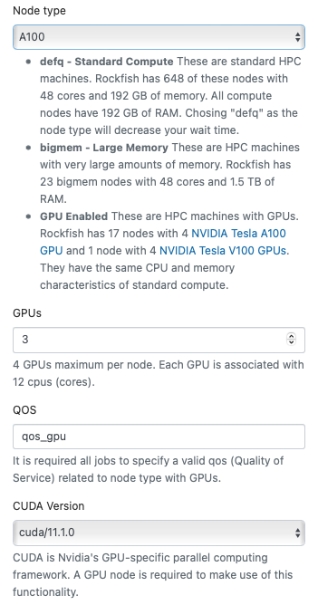

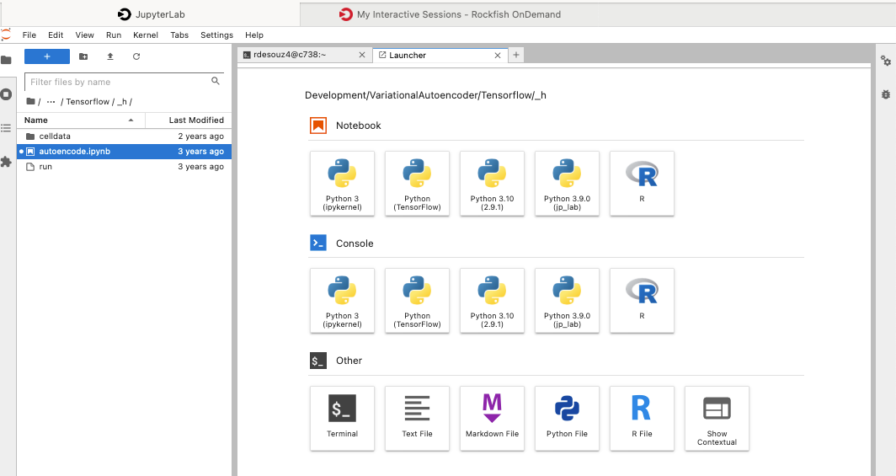