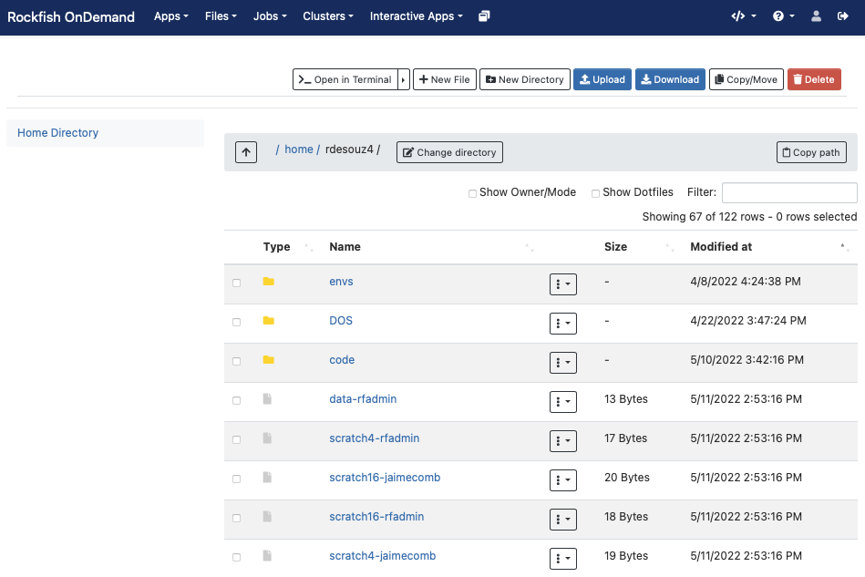
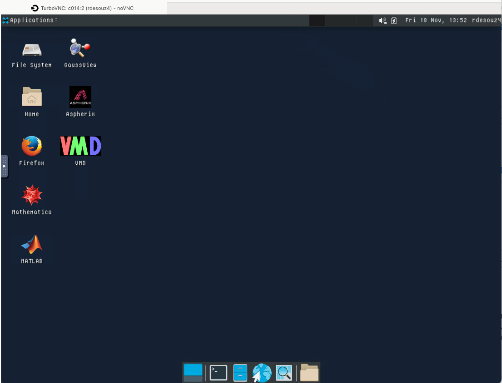
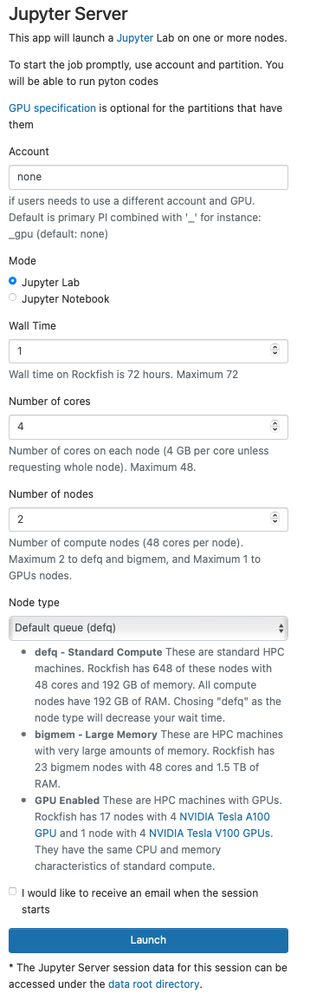
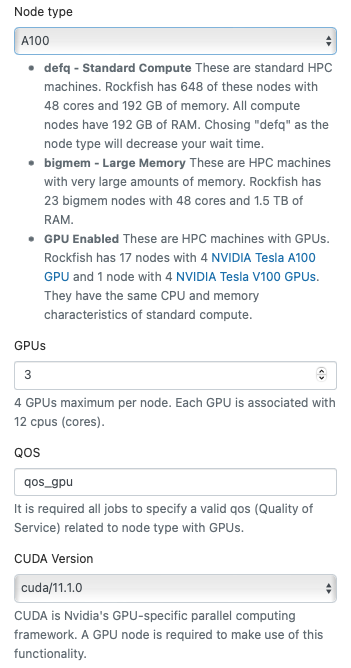

Open OnDemand
##############

HELP
****

e-mail to help@rockfish.jhu.edu (ticketing system)

Open OnDemand (`OOD`_) is an NSF-funded open-source HPC portal. It is a way for all our users to access the Rockfish cluster HPC resources via a web interface. It is a web-portal that provides a shell, file browser, and graphical interface for applications such as IGV, Matlab, ParaView, Jupyter and RStudio Server, etc.

.. _OOD: https://portal.rockfish.jhu.edu

A Rockfish account is necessary to use OOD. Also, a campus network connection or VPN is required to access the `OOD`_ portal.

|ood1|

Once authenticated, you will be on the main page.

|ood2|

|ood3|

Along the top are a pull-down menus for an Apps, Files App, Jobs, shell, and a list of Interactive Apps.

The file browser application provides a web-based file explorer that allows the user to remotely interact with the files on the Rockfish cluster’s local file system.
You can drag and drop files, download entire directories, and also move files between directories
all from within the web browser.

|ood4|

Interactive Apps (Plugins)
**************************

Interactive Apps provide a means for a user to launch and connect to an interactive batch job running a local web server (called Interactive App sessions) through the OnDemand portal (e.g., Abaqus/CAE, RStudio, Jupyter Lab and Notebook, MATLAB, Linux remote desktops) on Rockfish cluster. They are considered Dashboard App Plugins and not Passenger apps such as the Dashboard App, Shell App, Files App, and etc.

|ood5|

Remote Desktop
****************

Once in awhile, it is helpful to use a graphical interface to access data or certain programs. In this case, users have typically utilized VNC or X11 forwarding. Both of these tools have complications, either in complexity of setup or in performance. The Remote Desktop option from OOD simplifies the configuration of a VNC desktop session in a compute node.

First request the desktop application, i.e. anything under Desktops or GUIs, which you would like to use. Here we choose the Desktop.

|ood6|

You will next see a form to specify the resources you’d like for the job. Specifically the duration of the job (wall time), the number of cpus (cores), node type, etc. Below we ask for five hours and 2 cores. We also optionally specify a standard compute defq  with 4 Gb memory each cpu. If you wish you can also receive an email notification for when the job starts. Once you have filled out the form click Launch.

|ood7|

Once you launch the job, you will be presented with a notification that your job has been queued. Depending on the resources requested, your job should be scheduled within minutes. Then you will see the option to launch your session. Choose your display settings and click the launch button for your particular application, in this case Launch Remote Desktop.

|ood8|
|ood9|

Once Slurm Scheduler is ready to use the requested resource, click Launch.

|ood10|

|ood11|
So, if you have any problems starting this an app, look at Session ID: this case: (229e55a1-9808-4015-bb91-1ee36ffc3cc4), then open output.log file for more details.

Jupyter Lab / Notebook
**********************

This app will launch a `Jupyter`_ on one or more nodes, creating an interactive session that users will be able to launch a Jupyter Server within a batch job in a compute node. They will then be able to connect to the running server through their browser and take advantage of the resources provided within the batch job.
`GPU`_ specification is optional for the partitions that have them.

.. _Jupyter: https://jupyter.org/

.. _GPU: https://www.arch.jhu.edu/user-guide/

|ood12|

 :guilabel:`Defq` Standard Compute these are standard HPC machines. Rockfish has nodes with 48 cores and 192 GB of memory. All compute nodes have 192 GB of RAM. Chosing "defq" as the node type will decrease your wait time.

 :guilabel:`Bigmem` Large Memory these are HPC machines with very large amounts of memory. Rockfish has also bigmem nodes with 48 cores and 1.5 TB of RAM.

 :guilabel:`GPU` these are HPC machines with GPUs. Rockfish has nodes with 4 NVIDIA Tesla `A100`_ GPU and NVIDIA Tesla `V100`_ GPUs.

They have the same CPU and memory characteristics of standard compute.

.. _A100: https://www.nvidia.com/en-us/data-center/a100/
.. _V100: https://www.nvidia.com/en-us/data-center/v100/

|ood13|

Add multiple environments
^^^^^^^^^^^^^^^^^^^^^^^^^

You can use ipkernel and add multiple envs and select it inside Jupyter, just following the next instructions.

|ood14|

In a terminal console on Rockfish cluster run these commands:

.. code-block:: console

  Change to the proper version of python or conda
  ^^^^^^^^^^^^^^^^^^^^^^^^^^^^^^^^^^^^^^^^^^^^^^^^

  ## For Python Virtual environment

        $ module load python; source <myenv>/bin/activate

  ## For Conda environment

        $ module load anaconda; conda activate <myenv>

  then:

        (myenv)$ pip install ipykernel

  Install Jupyter kernel
  ^^^^^^^^^^^^^^^^^^^^^^
        (myenv)$ ipython kernel install --user --name=<any_name_for_kernel> --display-name "Python (myenv)"

  Listing all the available environments (kernels)
  ^^^^^^^^^^^^^^^^^^^^^^^^^^^^^^^^^^^^^^^^^^^^^^^^
        (myenv)$ jupyter kernelspec list

Troubleshooting
***************

Bad Request
^^^^^^^^^^^

 * Message : Your browser sent a request that this server could not understand. Size of a request header field exceeds server limit.

 **Solution** : Clear cache and cookies in your web browser.

 * Message : Requested resource does not exist.

 **Solution** : Enter URL https://portal.rockfish.jhu.edu/

.. |ood1| image:: images/ood1.png
  :alt: Login
  :width: 70 %

.. |ood2| image:: images/ood2.png
  :alt: Authenticated
  :width: 100 %

.. |ood3| image:: images/ood3.png
  :alt: Message
  :width: 100 %

.. |ood5| image:: images/ood5.png
  :alt: Interactive
  :width: 30 %

.. |ood6| image:: images/ood6.png
  :alt: Remote
  :width: 100 %

.. |ood7| image:: images/ood7.png
  :alt: Jupyter_Desktop
  :width: 60 %

.. |ood8| image:: images/ood8.png
  :alt: Queue
  :width: 80 %

.. |ood9| image:: images/ood9.png
  :alt: Starting
  :width: 80 %

.. |ood10| image:: images/ood10.png
  :alt: Launch
  :width: 80 %

.. |ood14| image:: images/ood14.png
  :alt: Jupyter
  :width: 100 %
